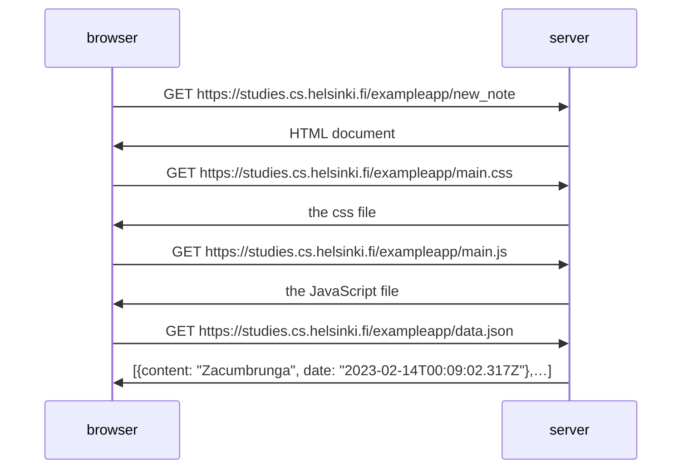
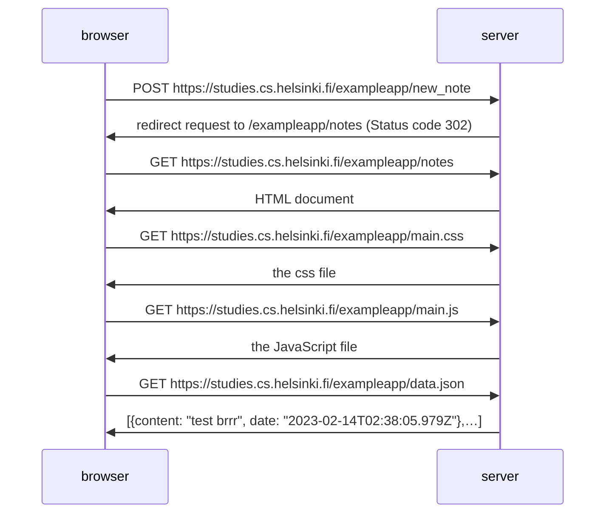

# 0.4: uusi muistiinpano

Ylemmässä kaaviossa on esitetty sivun lataus ja alemmassa tapahtumat selaimen ja palvelimen välillä, kun lähetetään lomake.

## Sivun lataus

```mermaid

sequenceDiagram
    participant browser
    participant server
    browser->>server: GET https://studies.cs.helsinki.fi/exampleapp/new_note
    server->>browser: HTML document
    browser->>server: GET https://studies.cs.helsinki.fi/exampleapp/main.css
    server->>browser: the css file
    browser->>server: GET https://studies.cs.helsinki.fi/exampleapp/main.js
    server->>browser: the JavaScript file
    browser->>server: GET https://studies.cs.helsinki.fi/exampleapp/data.json
    server->>browser: [{content: "Zacumbrunga", date: "2023-02-14T00:09:02.317Z"},…]

```

## Uusi muistiinpano

```mermaid

sequenceDiagram
    participant browser
    participant server
    browser->>server: POST https://studies.cs.helsinki.fi/exampleapp/new_note
    server->>browser: redirect request to /exampleapp/notes (Status code 302)
    browser->>server: GET https://studies.cs.helsinki.fi/exampleapp/notes
    server->>browser: HTML document
    browser->>server:GET https://studies.cs.helsinki.fi/exampleapp/main.css
    server->>browser: the css file
    browser->>server: GET https://studies.cs.helsinki.fi/exampleapp/main.js
    server->>browser: the JavaScript file
    browser->>server: GET https://studies.cs.helsinki.fi/exampleapp/data.json
    server->>browser: [{content: "test brrr", date: "2023-02-14T02:38:05.979Z"},…]

```